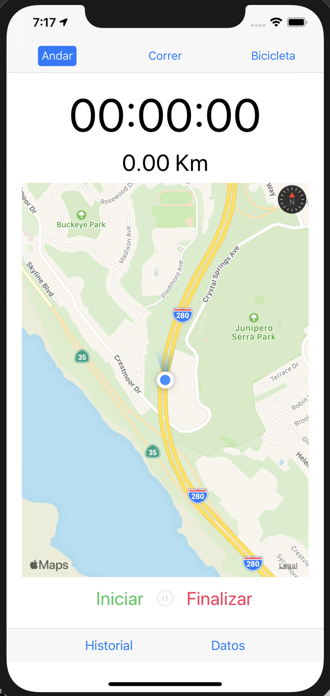

# AppFactoryB

### Características de la aplicación

- Diseño de una aplicación que nos permite hacer diferentes actividades.
- Tipos de actividades (Andar, Correr, Bicicleta).
- Nos permite ver la distancia recorrida.
- Nos permite ver el tiempo realizando actividad.
- Muestra nuestra posición en el mapa.
- Nos permite iniciar una nueva actividad, pausar nuestra actividad actual y finalizar la actividad.
- Minetras estamos realizando la actividad el mapa nos sigue.

### Fotos

### Cosas por terminar

- Guardar los datos de la persona
- Guardar estadísticas de las actividades hechas
